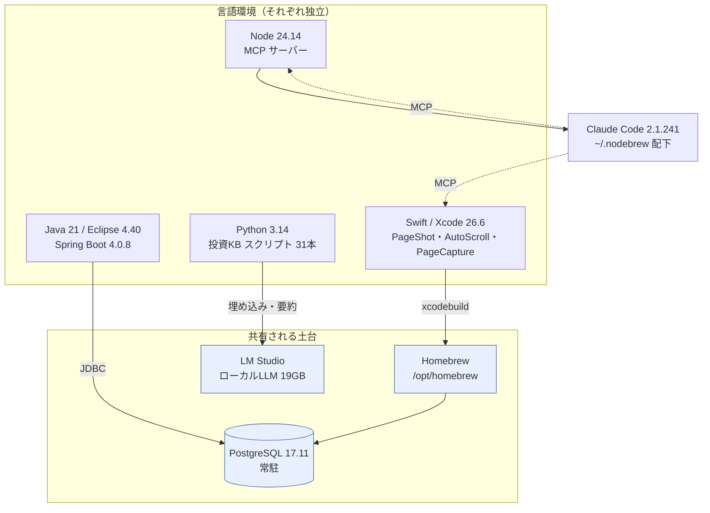
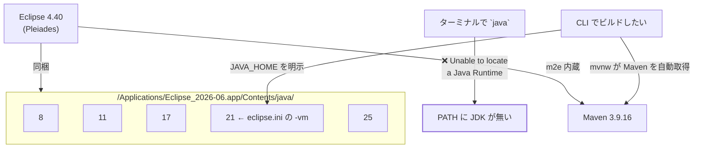
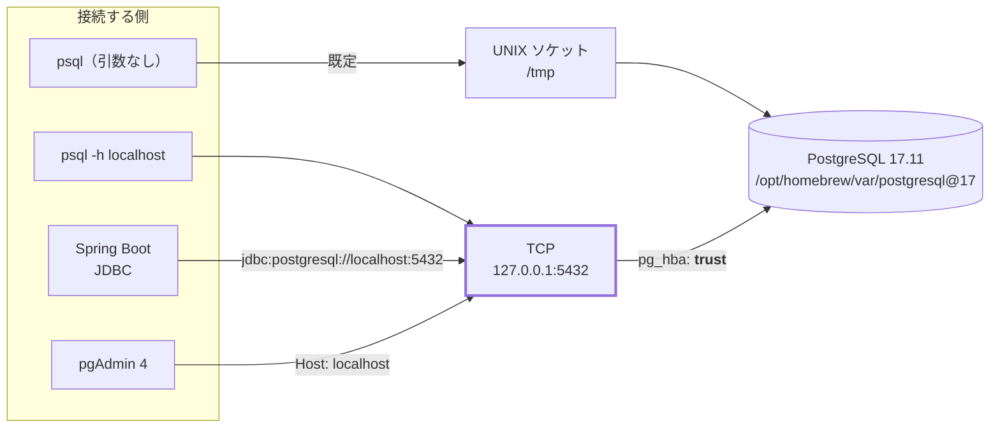
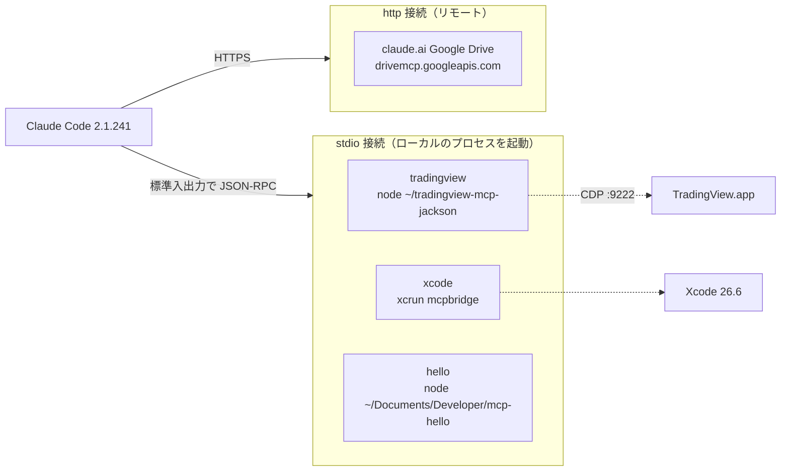
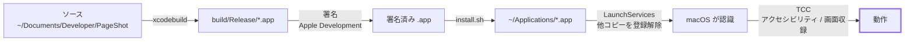
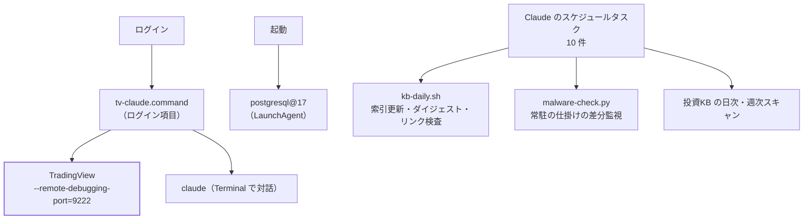

# この Mac の開発環境マップ

**2026-09-01 時点の実測。**すべて実機で確認した値で、推測は入っていない。

手順書ではなく**現況の地図**。「何が入っていて、どれがどれを使っているか」を引くためのもの。
構築手順は <mac-setup.md> / <xcode-claude-setup.md> /
<eclipse-spring-setup.md> にある。

| 項目 | 値 |
| --- | --- |
| 機種 | MacBook Pro / **Apple M1 Pro** / メモリ **16GB** |
| OS | **macOS 26.6.2**（Build 25G83） |
| ディスク | 使用 12GB / **空き 112GB** |
| パッケージ管理 | **Homebrew 6.0.18**（formula 115 / cask 0） |

---

## 1. 全体像 — 4 つの言語環境と、共有される土台



**言語環境どうしは繋がっていない。**Swift・Java・Python・Node は互いに独立していて、
共通するのは Homebrew と PostgreSQL と LM Studio だけ。
**片方を壊しても他方は動く**ので、切り分けはこの単位で考える。

Claude Code は Node の上に乗り、MCP 経由で Xcode などに手を伸ばす。

---

## 2. Python — Homebrew に一本化済み（2026-08-25 整理）

**素の `python3` は Homebrew の 3.14.6。**必要なライブラリはすべてここに揃っている。

```mermaid
flowchart LR
    CMD["`python3` と打つ"] --> P1

    subgraph path["PATH の優先順位（上が勝つ）"]
        direction TB
        P1["1. /opt/homebrew/bin<br/><b>Python 3.14.6</b>"]
        P2["5. /usr/bin<br/>Python 3.9.6"]
        P3["20. CommandLineTools<br/>Python 3.9.6"]
    end

    P1 -->|"numpy 2.4.3 / pandas 3.0.2 / matplotlib 3.10.8<br/>yfinance 1.2.1 / Pillow / requests"| R1["これが実行される"]
    P2 -.->|"numpy 1.26.2 / pandas 2.1.3 / yfinance"| R2["kb-daily.sh が明示的に指定<br/>（OS 同梱なので必ず在る）"]
    P3 -.-> R3["Xcode CLT 同梱。触らない"]

    style P1 stroke-width:3px
```

| 呼び方 | 実体 | 版 | 位置づけ |
| --- | --- | --- | --- |
| **`python3`（既定）** | Homebrew | **3.14.6** | **これを使う。**ライブラリ全部入り |
| `/usr/bin/python3` | macOS 同梱 | 3.9.6 | 消せない。`kb-daily.sh` が明示指定 |
| CommandLineTools | Xcode CLT 同梱 | 3.9.6 | 消せない。PATH の末尾に退避済み |

Homebrew の python は **yt-dlp / matplotlib / pipx が依存**しているので消せない。
だからこれを正とするのが自然。

### pyenv は廃止した

以前は pyenv の 3.14.0 が既定だった（`~/.python-version` によるグローバル指定）。
**shims が PATH の先頭に入るため、ライブラリの揃った Homebrew 側が常に隠れていた。**

| 廃止した理由 |  |
| --- | --- |
| 版が 1 つしか無い | pyenv に入っていたのは 3.14.0 だけで、Homebrew の 3.14.6 と重複 |
| 切り替える用途が無い | `.python-version` はホームに 1 つだけ。プロジェクト固有の固定はゼロ |
| 害があった | pandas / matplotlib / yfinance を持つ Homebrew を隠していた |

```bash
brew uninstall pyenv          # 4.5MB
rm -rf ~/.pyenv               # 420MB
rm -f ~/.python-version
brew uninstall python@3.12    # 70MB・依存ゼロ
```

**合計 約495MB を削減。**復活させるなら `brew install pyenv` から。

> ⚠️ **pyenv を消すだけでは直らなかった。**`.zshrc` の PATH 組み立てで
> `/Library/Developer/CommandLineTools/usr/bin` が**2回重複したうえ Homebrew より前**に
> 置かれていたため、pyenv を外すと今度は 3.9.6 が既定になる状態だった。
> **順序も同時に直している。**

### KB スクリプトが使うライブラリ

```
scripts/*.py（31本）の外部依存 = numpy のみ（4本）
pandas / yfinance / matplotlib を import しているスクリプト = 0 本
```

株価取得は標準ライブラリで行っている。`kb-daily.sh` は `/usr/bin/python3` を明示指定。

---

## 3. Java — ⚠️ JDK は Eclipse の中にしか無い



**Homebrew にも `/usr/bin` にも JDK は無い。**5 つの JDK はすべて Eclipse アプリの中にある。
Maven も m2e 内蔵で、`mvn` コマンドは PATH に無い（`mvnw` を使う）。

CLI から使うときは明示する。

```bash
export JAVA_HOME=/Applications/Eclipse_2026-06.app/Contents/java/21
export PATH="$JAVA_HOME/bin:$PATH"
./mvnw -B test
```

| 対象 | 値 |
| --- | --- |
| プロジェクト | `~/Documents/Developer/spring-mybatis-sandbox` |
| 構成 | Spring Boot **4.0.8** / MyBatis **4.0.1** / Java **21** |
| 動作確認 | `http://localhost:8080/actuator/health` → `{"status":"UP"}` |

---

## 4. PostgreSQL — ⚠️ 経路が 2 つある

**同じ DB に 2 つの入口があり、片方だけ通ることがある。**
「psql では繋がるのにアプリからは Connection refused」の正体はこれ。



**疎通確認は必ず `-h localhost` を付ける。**付けないと UNIX ソケット経由になり、
アプリが使う TCP 経路の確認にならない。

| 項目 | 値 |
| --- | --- |
| 版 | **PostgreSQL 17.11**（Homebrew） |
| 常駐 | `brew services` で **started**（LaunchAgent） |
| データ | `/opt/homebrew/var/postgresql@17` |
| ソケット | `/tmp` |
| DB | `postgres`, **`sandbox`** |
| ロール | `shibuyamorishige`（管理者）, `sandbox` |
| GUI | **pgAdmin 4 (9.17)** |

> ⚠️ **ローカル接続は `trust`（パスワード不要）。**
> `pg_hba.conf` が `127.0.0.1/32 trust` なので、**この Mac のどのプロセスも
> 管理者ロールを含む任意のユーザーとして接続できる。**開発機なので実害は小さいが把握しておく。

### pgAdmin の接続値

| 項目 | 値 |
| --- | --- |
| Server Name | 任意の**表示名**（接続先ではない。空だとエラーになるだけ） |
| Host / Port | `localhost` / `5432` |
| Database / User / Password | `sandbox` / `sandbox` / `sandbox` |

---

## 5. MCP — Claude Code が外部に手を伸ばす仕組み



登録は **user スコープ**（`~/.claude.json`）で 3 件。Google Drive は claude.ai 側の接続。

| サーバー | 種別 | 実体 | 状態 |
| --- | --- | --- | --- |
| **tradingview** | stdio | `node ~/tradingview-mcp-jackson/src/server.js` | ✔ 接続 |
| **xcode** | stdio | `xcrun mcpbridge` | ⚠ 接続するが tools 取得が時々タイムアウト |
| **hello** | stdio | `node ~/Documents/Developer/mcp-hello/server.js` | ✔ 接続（自作サンプル） |
| Google Drive | http | `drivemcp.googleapis.com` | ✔ 接続 |

> **stdio サーバーの鉄則：標準出力は JSON-RPC 専用。**
> `console.log` を書くとプロトコルが壊れる。ログは必ず `console.error`（stderr）へ。

TradingView は **ログイン時に自動でデバッグポート付きで起動**する
（`~/bin/tv-claude.command` がログイン項目に登録済み）。

---

## 6. Xcode — ビルドから権限までの鎖

**自作アプリが動くまでに 4 つの関門がある。**どれが切れても症状は「動かない」なので、
順に切り分ける。



| 段階 | 確認方法 | よくある失敗 |
| --- | --- | --- |
| ビルド | `BUILD SUCCEEDED` | ⭐**成果物を iCloud 内に出すと codesign が落ちる**（下記） |
| 署名 | `security find-identity -v -p codesigning` | 中間 CA の期限切れ |
| 配置 | `install.sh` | **同じ Bundle ID の別コピーが残る** |
| 権限 | アプリ内の「状態を再確認」 | **署名と場所に紐づくので再ビルドで外れる** |

| 項目 | 値 |
| --- | --- |
| Xcode | **26.6**（Build 17F113） |
| xcode-select | `/Applications/Xcode.app/Contents/Developer` |
| Command Line Tools | 26.6.0.0.1781586589 |
| 署名 ID | `Apple Development: t_york@mac.com (64RVC5V48M)` |
| 自作アプリ | `~/Applications/PageShot.app`, `AutoScroll.app`, **`PageCapture.app`**（2026-08-28 追加） |

> **「ビルドが通った」は「動く」ではない。**権限が絡むので実挙動は別に確認する。

> 🛑 **ソースを iCloud（`~/Documents/Developer`）に置いたことの代償（2026-09-01 に実測）。**
> iCloud は同期対象のファイルに `com.apple.FinderInfo` / `com.apple.fileprovider.*` を付ける。
> **codesign はこれを撥ねる** —— `resource fork, Finder information, or similar detritus not allowed`。
> ビルドのたびに付き直すので、`xattr -cr` で消しても再発する。
> ⭐ **対処は 1 つだけ —— 成果物を iCloud の外に出す**
> （`~/Library/Developer/LocalBuilds/`。PageShot / PageCapture / AutoScroll の `build.sh` が全部これ）。
> 🛑 **「署名の直前に `xattr -cr`」は効かない。**appex を署名してから外側の `.app` を
> 署名するまでの間に iCloud が付け直す。**一度この方法を採って、クリーンビルドで再発した。**
> **Xcode の GUI は既定の DerivedData（`~/Library` 配下）に出すので影響を受けない。**
> 踏むのは `xcodebuild` を素で叩いたときと、成果物をリポジトリ内に置くスクリプト。

---

## 7. ローカル LLM（LM Studio）

| 用途 | モデル | サイズ |
| --- | --- | --- |
| **意味検索の埋め込み** | `text-embedding-nomic-embed-text-v1.5` | 84MB（LM Studio 同梱） |
| 文字起こしの要約 | `mlx-community/gemma-3-12b-it-qat-4bit` | — |
| 汎用 | `mlx-community/gpt-oss-20b-MXFP4-Q8` | — |
|  | **合計** | **19GB** |

API は `http://localhost:1234/v1`（OpenAI 互換）。**通信は端末内で完結する。**

> ⚠️ **LLM に事実を持たせない。**12B は日付や数値を取り違える。
> 数字はスクリプトで機械的に抽出し、LLM には言語化だけさせる。
> OCR も生成モデルではなく Vision / Tesseract を使う（意味から補完させない）。

---

## 8. 常駐しているもの・自動で動くもの



| 種類 | 内容 |
| --- | --- |
| LaunchAgent | `homebrew.mxcl.postgresql@17`（他は Dropbox / Google / Steam / MEGA / openclaw の更新系） |
| ログイン項目 | **`tv-claude.command`** |
| 定期実行 | **Claude のスケジュールタスク 10 件**（`kb-daily.sh` / `daily-security-check` / 投資スキャン各種） |

> ⚠️ **launchd から `~/Documents` は読み書きできない**（TCC）。
> だから KB の定期処理は launchd ではなく Claude のスケジュールタスクに置いている。

### 常駐の仕掛けを見張る（2026-09-01 追加）

macOS のマルウェアは、ほぼ例外なく**再起動後も生き残るための仕掛け**を残す。
そこで LaunchAgent / LaunchDaemon・ログイン項目・構成プロファイル・kext・`/etc/hosts`・
アドウェアの常用領域・Safari 拡張の **7 経路だけ**を毎日棚卸しし、**前回との差分**を出す。

```bash
python3 ~/bin/malware-check.py          # 差分だけ（定期タスク daily-security-check が毎日10:10に実行）
python3 ~/bin/malware-check.py --full   # 現在の全項目
python3 ~/bin/malware-check.py --baseline   # ⚠️ 本人だけが打つ
```

基準は `~/.local/state/security-check/snapshot.json`。現在 **16 件**。

> 🛑 **`--baseline` は「今の状態を正常として承認する」操作。**初版は 🔴 を1回報告した後に
> 現状を基準へ取り込んでいて、**2回目以降は黙る**＝その1回を見逃したら永久に気づけない、
> という欠陥があった（2026-09-01 に検証で発見し修正）。今は 🔴 がある間は基準を更新せず、
> 承認されるまで毎回言い続ける。**エージェントに打たせない。**

> ⚠️ 見ているのは**既知の常駐経路の変化だけ**。シグネチャ照合・未知のマルウェア・
> rootkit・メモリ常駐型は検出しない。**「変化なし」は「感染していない」ではない。**

同日、実行できない残骸も片付けた。

| 片付けたもの | 何だったか |
| --- | --- |
| 空の LaunchAgent 4 件 | Google Keystone / Dropbox 旧更新系の抜け殻（中身が `{}`）。`removed-20260901/` へ退避 |
| `com.sony.SonyAutoLauncher` | 2017 年の **i386** バイナリで Apple Silicon では実行不可。しかも実行ファイルと親ディレクトリが **777**＝誰でも差し替えられ、ログインのたびに読み込まれる口だった |

---

## 9. ディレクトリの地図

```
~/
├── Documents/                    ⚠️ iCloud 同期対象
│   ├── Developer/                ソースコード（2026-09-01 に ~/Developer から移動）
│   │   ├── App/                  ⭐ 自作アプリの仕様書【正本】
│   │   │   ├── PageShot.md
│   │   │   ├── PageCapture.md
│   │   │   └── AutoScroll.md
│   │   ├── PageShot/             macOS アプリ（撮影 + OCR）
│   │   ├── SafariAutoScroll/     Safari 拡張（自動スクロール）
│   │   ├── PageCapture/          Safari 拡張（全画面を1枚のPNGに）
│   │   ├── spring-mybatis-sandbox/  Spring Boot + MyBatis
│   │   ├── mcp-hello/            MCP サーバーの自作サンプル
│   │   └── MAC_APP/ Safari_Extension_App/   Xcode テンプレートの雛形
│   │
│   ├── knowledge/                投資ナレッジベース
│   │   ├── scripts/              Python 31本（link_check.py でリンク切れ検査）
│   │   ├── books/ ideas/ docs/   ノート
│   │   └── data/                 索引・状態
│   │
│   └── setup-guides/             このファイルを含む環境ドキュメント
│
├── bin/                          PATH 済み。新規追加時は rehash が要る
│   ├── kb-daily.sh               日次の KB 保守
│   ├── malware-check.py          常駐の仕掛けの差分監視
│   ├── ocr-folder                画像フォルダ → テキスト
│   ├── yt-transcribe.sh          YouTube → 文字起こし
│   ├── remote-control.sh         iPhone から操作する口を開ける
│   └── tv-claude.command         ログイン時の起動スクリプト
│
├── .local/state/security-check/  常駐チェックの基準・履歴・退避
│
└── Applications/                 自作アプリ（PageShot / AutoScroll / PageCapture）
```

---

## 10. 迷ったときの早見表

| 症状 | まず疑う |
| --- | --- |
| `python3` で pandas が無い | 2026-08-25 に Homebrew へ一本化済み。`command -v python3` を確認 |
| `java: Unable to locate` | JDK は Eclipse の中だけ。`JAVA_HOME` を明示 |
| `mvn: command not found` | 正常。`./mvnw` を使う |
| psql は繋がるがアプリは `Connection refused` | **`-h localhost` で TCP を確認** |
| 急に DB に繋がらない | `brew services list` で `started` か確認 |
| `~/bin` に置いたのに `command not found` | **`rehash`**（zsh がコマンド位置をハッシュしている） |
| MCP サーバーが応答しない | stdout に `console.log` を書いていないか |
| 自作アプリの権限が外れた | 署名と場所に紐づく。設定でチェックを外して入れ直す |
| launchd のジョブが Documents を読めない | **TCC。**Claude のスケジュールタスク側に置く |
| Docker が動かない | **常駐していない。**必要なときだけ起動する |

---

## 変更したときに直す場所

この地図は実測値なので、環境を変えたら**測り直して更新する。**

| 変えたもの | 影響する節 |
| --- | --- |
| Homebrew の python の版 | 2（Python） |
| Eclipse の版 | 3（Java） |
| PostgreSQL の版・`pg_hba.conf` | 4（DB） |
| MCP の追加・削除 | 5（MCP） |
| Xcode の版・署名証明書 | 6（Xcode）— 証明書の期限は **2027-08-15** |
| LM Studio のモデル | 7（LLM） |
