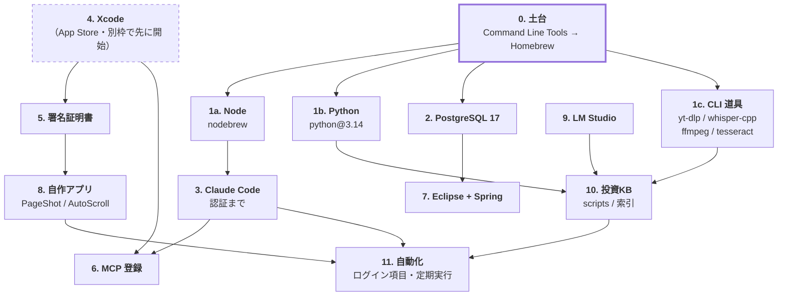
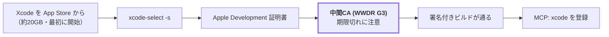
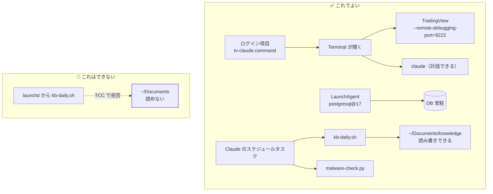

# まっさらな Mac から、この環境を再構築する

**順序が命。**下の依存関係を外すと、後の工程で必ず詰まる。
各工程の詳細は既存のガイドに委ねる。**ここは「どの順で、なぜその順か」に絞る。**

| 前提 | 値 |
| --- | --- |
| 対象 | Apple Silicon Mac（M1 以降）/ macOS 26 系 |
| 所要 | **回線が速い日で 3〜4 時間**（Xcode と LM Studio のダウンロードが支配的） |
| 空き容量 | **60GB 以上**（Xcode 約 20GB / LLM 19GB / Maven・npm 数GB） |

---

## 依存関係 — この順でしか組めない



**Xcode のダウンロードは最初に始めて、裏で走らせながら他を進める。**約 20GB あり、
これを待つ時間が全体の律速になる。

> ⚠️ **GUI アプリは Homebrew Cask を使っていない**（cask 0 件）。
> Xcode / Eclipse / VS Code / pgAdmin / LM Studio / Docker / TradingView は
> **すべて手動でダウンロードして入れる。**再現するときも同じにすると差分が出ない。

---

## 0. 土台

```bash
xcode-select --install
/bin/bash -c "$(curl -fsSL https://raw.githubusercontent.com/Homebrew/install/HEAD/install.sh)"
```

Apple Silicon では Homebrew が `/opt/homebrew` に入る。PATH を通す。

```bash
echo 'eval "$(/opt/homebrew/bin/brew shellenv)"' >> ~/.zprofile
exec zsh -l
```

**ここで `~/bin` も作って PATH に入れておく。**あとで自作スクリプトを置く。

```bash
mkdir -p ~/bin
echo 'export PATH="$HOME/bin:$PATH"' >> ~/.zshrc
```

> ⚠️ **`~/bin` に新しいファイルを置いた直後は `rehash` が要る。**
> zsh は起動時にコマンド位置をハッシュするので、既存のターミナルでは
> `command not found` になる。

### 検証

```bash
brew --version && echo $PATH | tr ':' '\n' | grep -E "homebrew|/bin$"
```

---

## 1. 言語ランタイムと CLI 道具

**3 つは互いに独立**なので、順不同で並行して進めてよい。

### 1a. Node（Claude Code の土台）

```bash
brew install nodebrew
nodebrew setup
echo 'export PATH="$HOME/.nodebrew/current/bin:$PATH"' >> ~/.zshrc
exec zsh -l
nodebrew install-binary latest && nodebrew use latest
```

> ⚠️ **`~/.nodebrew/current/bin` は GUI から起動したプロセスの PATH に入らない。**
> ログイン項目や launchd から `claude` を呼ぶスクリプトでは、PATH を明示すること
> （<dev-environment-map.md> の 8 節を参照）。

### 1b. Python — **Homebrew 一本**

```bash
brew install python@3.14
pip3 install numpy pandas matplotlib yfinance pillow requests
```

> ⚠️ **pyenv は入れない。**2026-08-25 に一度入れて廃止した。
> 版が1つしか要らないなら shims が挟まるだけ損で、しかも
> **ライブラリの揃った Homebrew 側を隠してしまう**（実際に隠れていた）。
> プロジェクトごとに版を変える必要が出てから入れればよい。

**PATH の順序に注意。**`/opt/homebrew/bin` を
`/Library/Developer/CommandLineTools/usr/bin` より**前**に置くこと。
逆だと `python3` が CLT 同梱の 3.9.6 になる。

```bash
# 確認
command -v python3        # → /opt/homebrew/bin/python3
python3 --version         # → Python 3.14.x
```

消せない Python が 2 つ残るが、これは正常。

| 実体 | 消せない理由 |
| --- | --- |
| `/usr/bin/python3` (3.9.6) | macOS 同梱 |
| CommandLineTools (3.9.6) | Xcode CLT 同梱 |

### 1c. CLI 道具

```bash
brew install yt-dlp whisper-cpp ffmpeg tesseract tesseract-lang jq
```

| 道具 | 用途 |
| --- | --- |
| `yt-dlp` + `whisper-cpp` + `ffmpeg` | YouTube → 文字起こし（`yt-transcribe.sh`） |
| `tesseract` + `tesseract-lang` | **縦書き日本語の OCR**（約 686MB） |

whisper のモデルは別途落とす。

```bash
mkdir -p ~/whisper-models
# ggml-large-v3-turbo.bin を ~/whisper-models/ に置く
```

> **横書きの OCR に Tesseract は要らない。**macOS 内蔵の Vision で足りる。
> Tesseract が必要なのは**縦組み日本語**だけ（Vision は 1 文字も読めない）。

---

## 2. PostgreSQL

```bash
brew install postgresql@17
brew services start postgresql@17
echo 'export PATH="/opt/homebrew/opt/postgresql@17/bin:$PATH"' >> ~/.zshrc
exec zsh -l
```

`postgresql@17` は keg-only なので PATH を通す必要がある。
インストール時にデータベースクラスタが自動作成される。

```bash
psql -d postgres -c "CREATE ROLE sandbox WITH LOGIN PASSWORD 'sandbox';"
psql -d postgres -c "CREATE DATABASE sandbox OWNER sandbox;"
```

### 検証は **必ず `-h localhost`** を付ける

```bash
PGPASSWORD=sandbox psql -h localhost -U sandbox -d sandbox -c "SELECT current_user;"
```

> ⚠️ **付けないと UNIX ソケット経由**になり、アプリが使う TCP 経路の確認にならない。
> 「psql では繋がるのにアプリからは Connection refused」はこれが原因。

GUI が要るなら **pgAdmin 4** を手動で入れる。接続値は
<dev-environment-map.md> の 4 節にある。

---

## 3. Claude Code

```bash
npm install -g @anthropic-ai/claude-code
claude login
```

> ⚠️ **`ANTHROPIC_API_KEY` が環境変数にあると OAuth 認証と衝突する。**
> `~/.zshrc` に残っていないか確認すること。あればコメントアウトする。

詳細は <xcode-claude-setup.md> の 3 節。

---

## 4〜6. Xcode / 署名 / MCP

**この 3 つは <xcode-claude-setup.md> に全部書いてある。**
ここでは順序と関門だけ示す。



| 関門 | 確認 |
| --- | --- |
| Xcode の選択 | `xcode-select -p` が `/Applications/Xcode.app/Contents/Developer` |
| 署名 ID | `security find-identity -v -p codesigning` に **1 件以上** |
| 中間 CA | **`0 valid identities found` なら WWDR の期限切れ**を疑う |
| MCP | `claude mcp list` で `xcode` が Connected |

MCP は user スコープ（`~/.claude.json`）に登録する。

```bash
claude mcp add --scope user xcode -- xcrun mcpbridge
```

> **自作 MCP サーバーの鉄則：標準出力は JSON-RPC 専用。**
> `console.log` を書くとプロトコルが壊れる。ログは `console.error` へ。
> 動くサンプルが `~/Documents/Developer/mcp-hello/server.js` にある。

---

## 7. Eclipse + Spring Boot

**PostgreSQL（2 節）を先に済ませておくこと。**

Pleiades All in One を手動でダウンロードして `/Applications` に置く。

```bash
sudo xattr -dr com.apple.quarantine /Applications/Eclipse_2026-06.app
```

> ⚠️ **これをしないと起動できない。**Pleiades は Apple の公証を受けていないため、
> Gatekeeper が「開く」ボタンすら出さない。マルウェアだからではない。

**JDK と Maven は Eclipse に同梱されている。**別途インストールは不要。
ただし**ターミナルからは使えない**ので、CLI で使うなら明示する。

```bash
export JAVA_HOME=/Applications/Eclipse_2026-06.app/Contents/java/21
export PATH="$JAVA_HOME/bin:$PATH"
```

プロジェクト生成からバージョンの罠まで、詳細は
<eclipse-spring-setup.md>。

---

## 8. 自作アプリ

**署名（5 節）が通っていること。**

```bash
cd ~/Documents/Developer/PageShot        && ./build.sh && ./install.sh
cd ~/Documents/Developer/SafariAutoScroll && ./build.sh && ./install.sh
cd ~/Documents/Developer/PageCapture      && ./build.sh && ./install.sh
```

> 🛑 **ソースは iCloud 配下（`~/Documents/Developer`）にあるので、
> ビルド成果物を iCloud の中に出してはいけない。**
> iCloud が `com.apple.FinderInfo` を付け、**codesign が
> `resource fork, Finder information, or similar detritus not allowed` で失敗する。**
> **回避策は 3 本とも同じ —— 出力先ごと `~/Library/Developer/LocalBuilds/` に逃がす。**
> 各 `build.sh` がそうしている。
> ⚠️ **「署名の直前に `xattr -cr` を掛ける」では直らない。**appex を署名してから
> 外側の `.app` を署名するまでの間に iCloud が付け直すため、クリーンビルドで再発する
> （2026-09-01 に一度この方法を採って失敗した）。
> **`xcodebuild` を素で叩くと既定で `<プロジェクト>/build` に出るため、必ず踏む。**

| アプリ | 用途 | 要る権限 |
| --- | --- | --- |
| **PageShot** | ← / → で最前面ウィンドウを撮る ＋ OCR | アクセシビリティ・画面収録 |
| **AutoScroll** | Safari の自動スクロール ＋ 自動ページ送り | Safari 拡張の有効化 |
| **PageCapture** | Safari のページ全体を 1 枚の PNG に | Safari 拡張の有効化 |

> ⚠️ **Safari 拡張は `install.sh` を必ず通す。**Xcode でビルドすると DerivedData 側が
> macOS に登録され、`~/Applications` のものを押しのける。放置すると Safari が拡張を見失う。

> ⚠️ **権限は署名と場所に紐づく。**再ビルドや移動のあと、システム設定で
> 一度チェックを外して入れ直す必要が出ることがある。
> **「ビルドが通った」は「動く」ではない。**

---

## 9. LM Studio（ローカル LLM）

手動でダウンロードして起動。モデルを 3 つ入れる。

| モデル | 用途 | 備考 |
| --- | --- | --- |
| `text-embedding-nomic-embed-text-v1.5` | **KB の意味検索** | 84MB・LM Studio 同梱 |
| `mlx-community/gemma-3-12b-it-qat-4bit` | 文字起こしの要約 |  |
| `mlx-community/gpt-oss-20b-MXFP4-Q8` | 汎用 |  |

サーバーを `http://localhost:1234/v1` で起動しておく（OpenAI 互換）。

> ⚠️ **LLM に事実を持たせない。**12B は日付や数値を取り違える。
> 数値はスクリプトで機械的に抽出し、LLM には言語化だけさせる。
> **OCR にも使わない**（意味から補完してしまう）。

---

## 10. 投資ナレッジベース

`~/Documents/knowledge` を復元したら、索引を作り直す。

```bash
python3 ~/Documents/knowledge/scripts/kb_search.py --index
python3 ~/Documents/knowledge/scripts/link_check.py
```

`~/bin` にスクリプトを置いて実行権を付ける。

```bash
chmod +x ~/bin/*.sh ~/bin/*.command
rehash
```

| スクリプト | 用途 |
| --- | --- |
| `kb-daily.sh` | 索引更新・ダイジェスト化・**リンク検査** |
| `yt-transcribe.sh` | YouTube → 文字起こし |
| `ocr-folder` | 画像フォルダ → テキスト（`ocr_folder.swift` をビルド） |

`ocr-folder` はソースからビルドする。

```bash
swiftc -O -sdk "$(xcrun --show-sdk-path)" \
  ~/Documents/knowledge/scripts/ocr_folder.swift -o ~/bin/ocr-folder
rehash
```

---

## 11. 自動化



**launchd から `~/Documents` は読み書きできない**（TCC）。
だから KB の定期処理は **Claude のスケジュールタスク側**に置く。

対話プログラム（`claude`）は端末が要るので、**ログイン項目から `.command` を開く**方式にする。

```bash
# ログイン項目に登録
osascript -e 'tell application "System Events" to make login item at end \
  with properties {path:"/Users/<名前>/bin/tv-claude.command", hidden:false}'
```

> ⚠️ **`.command` の中では PATH を明示する。**GUI から起動されるとログインシェルの
> 設定が効かず、`claude` が見つからない。

### 常駐の仕掛けを見張る

組み終わったら、**その状態を「正常」として記録しておく。**以後はここからの差分だけを見る。

```bash
python3 ~/bin/malware-check.py --baseline   # 組み上げ直後に 1 回だけ
python3 ~/bin/malware-check.py              # 以後は差分が出る
```

定期タスク `daily-security-check`（毎日10:10）が自動で回す。

> 🛑 **`--baseline` は本人だけが打つ。**「今の状態を正常として承認する」操作なので、
> 🔴 が出ている状態で打つと、それを正常として飲み込んでしまう。

---

## 全体の検証

上から順に通れば、環境は揃っている。

```bash
brew --version                                    # 0. 土台
node --version && claude --version                # 1a / 3
python3 -c "import numpy; print(numpy.__version__)"   # 1b
psql -h localhost -U sandbox -d sandbox -c "SELECT 1" # 2
xcodebuild -version                               # 4
security find-identity -v -p codesigning | tail -1    # 5
claude mcp list                                   # 6
curl -s localhost:1234/v1/models | head -c 80     # 9
python3 ~/Documents/knowledge/scripts/link_check.py --quiet   # 10
```

Java は PATH に無いのが正常。確認するなら明示する。

```bash
/Applications/Eclipse_2026-06.app/Contents/java/21/bin/java -version
```

---

## つまずいたときの早見表

**症状から原因を引く。**個別の詳細は各ガイドへ。

| 症状 | 原因 | 対処 |
| --- | --- | --- |
| `~/bin` に置いたのに `command not found` | zsh のコマンドハッシュ | **`rehash`** |
| `python3` が 3.9.6 になる | PATH で CLT が Homebrew より前 | `.zshrc` の PATH 順序を直す |
| `java: Unable to locate` | JDK は Eclipse の中だけ | `JAVA_HOME` を明示 |
| `mvn: command not found` | Maven も同梱のみ | **正常。**`./mvnw` を使う |
| `psql: command not found` | keg-only で PATH 未設定 | `~/.zshrc` に追記 → `rehash` |
| psql は繋がるがアプリは `Connection refused` | UNIX ソケット経由で確認していた | **`-h localhost`** |
| 急に DB に繋がらない | サービス停止 | `brew services list` → `restart` |
| Eclipse が「開いていません」 | 公証されていない | `sudo xattr -dr com.apple.quarantine` |
| `0 valid identities found` | 中間 CA の期限切れ | WWDR G3 を入れ直す |
| Claude Code の認証が通らない | `ANTHROPIC_API_KEY` と衝突 | `~/.zshrc` から外す |
| MCP サーバーが応答しない | stdout に `console.log` | `console.error` に変える |
| 自作アプリの権限が外れた | 署名と場所に紐づく | 設定でチェックを外して入れ直す |
| 定期実行が Documents を読めない | **TCC** | Claude のスケジュールタスク側へ |
| ログイン項目から `claude` が起動しない | GUI の PATH が違う | `.command` 内で PATH を明示 |

---

## 関連

| ドキュメント | 内容 |
| --- | --- |
| <dev-environment-map.md> | **今どうなっているか**の地図（実測値・図 7 枚） |
| <xcode-claude-setup.md> | Xcode・署名・MCP の詳細 |
| <eclipse-spring-setup.md> | Java・Spring・PostgreSQL の詳細 |
| <mac-setup.md> | 日々の道具の**使い方** |
