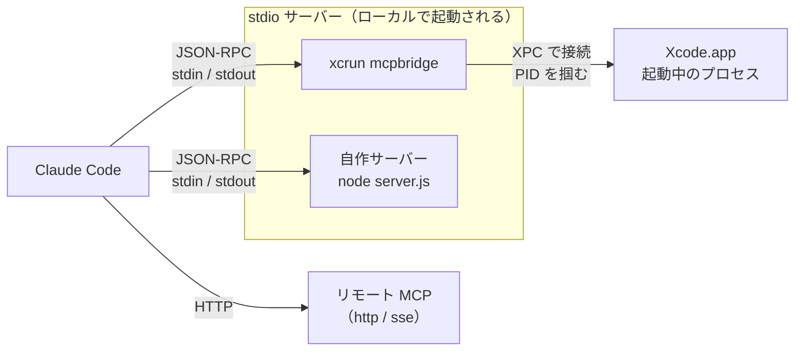
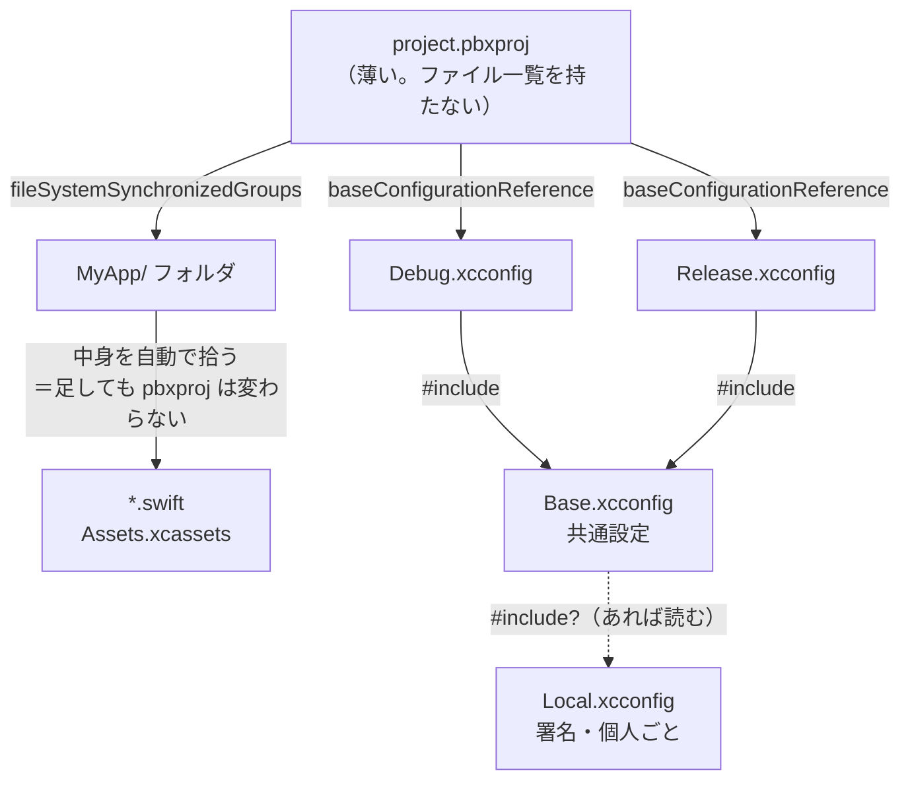
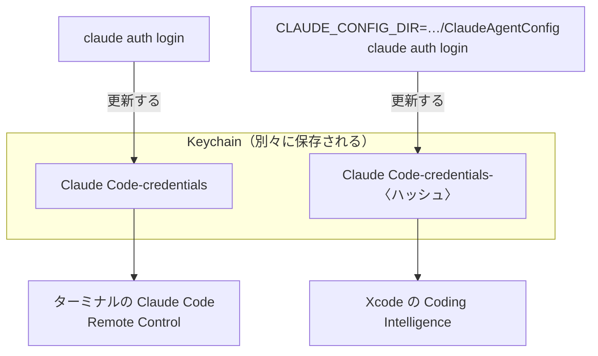

# Xcode × Claude Code 環境構築ガイド

Mac で Xcode アプリを Claude Code と一緒に開発するための手順。

このガイドは、実際に構築したときに**踏んだ落とし穴をそのまま残してある**。
手順どおりに進めれば同じ穴は避けられる。所要は 1〜2 時間（ダウンロード時間を含む）。

検証環境: MacBook Pro (M1 Pro) / macOS 26.6 / Xcode 26.6 / Claude Code 2.1.237

> **担当: Xcode・署名・ビルド成果物の置き場所・Claude Code の認証・MCP。**
> `ANTHROPIC_API_KEY` との衝突、MCP の stdout の鉄則、iCloud 配下での codesign 失敗はこの文書が正本。
> 今の版や登録済み MCP の一覧は [dev-environment-map.md](dev-environment-map.md) を見る。

---

## 全体像

やることは 6 つ。上から順に進める。**順番を飛ばすと後で戻ることになる。**

0. 前提を揃える（Apple ID / Homebrew / Node / Claude Code / git）
1. Xcode を入れて、コマンドラインから使えるようにする
2. 署名証明書を用意する
3. Claude Code を認証する
4. Xcode の MCP サーバーを Claude Code に登録する（＋他の MCP も足せる）
5. プロジェクトを作る

---

## 0. 前提を揃える

**買ったばかりの Mac を想定している。**すでに入っているものは飛ばしてよい。

### 0-1. Apple ID

Xcode のインストール（App Store）と署名証明書の両方で要る。無料のもので足りる。

### 0-2. Homebrew

Node など開発用ツールの導入に使う。

```bash
/bin/bash -c "$(curl -fsSL https://raw.githubusercontent.com/Homebrew/install/HEAD/install.sh)"
```

インストール後、**PATH を通す指示が表示される**ので、それに従う
（Apple Silicon なら `/opt/homebrew/bin` を追加する内容）。

```bash
brew --version     # 確認
```

### 0-3. Node.js

**Claude Code 本体と、自作 MCP サーバーの両方で必要。**

この Mac では **nodebrew** で入れている（版を切り替えられるため）。

```bash
brew install nodebrew
nodebrew setup
echo 'export PATH="$HOME/.nodebrew/current/bin:$PATH"' >> ~/.zshrc
exec zsh -l
nodebrew install-binary latest && nodebrew use latest
node --version     # v22 以上を推奨
npm --version
```

> 版の切り替えが要らなければ `brew install node` でも足りる。
> ただし再構築するときは実機と同じ nodebrew にそろえる（差分を出さないため）。

> ⚠️ `~/.nodebrew/current/bin` は **GUI から起動したプロセスの PATH に入らない。**
> ログイン項目や `.command` から `claude` を呼ぶときは PATH を明示する
> （[full-build-guide.md](full-build-guide.md) の 11 節）。

### 0-4. Claude Code

```bash
npm install -g @anthropic-ai/claude-code
claude --version
```

`command not found: claude` になる場合は、npm のグローバル bin が PATH に
入っていない。場所を確認して `~/.zshrc` に追加する。

```bash
npm bin -g          # ここが PATH に含まれているか確認
```

> **注意**: 既存ターミナルでは PATH を直しても効かないことがある。
> zsh は起動時にコマンド位置を記憶するため、`rehash` を実行するか
> 新しいタブを開く。

### 0-5. git の初期設定

コミットに名前とメールが要る。未設定だとコミット時にエラーになる。

```bash
git config --global user.name  "あなたの名前"
git config --global user.email "you@example.com"
```

git 本体は macOS 標準（`/usr/bin/git`）にあるので導入は不要。

### 0-6. ここまでの確認

```bash
brew --version && node --version && npm --version && claude --version && git --version
```

すべて出力されれば次へ進む。

---

## 1. Xcode を入れる

App Store から Xcode をインストールする。**約 20GB** あるので回線に余裕のあるときに。

インストール後、**必ずこれを実行する。**

```bash
sudo xcode-select -s /Applications/Xcode.app/Contents/Developer
```

### なぜ必要か

Command Line Tools だけが入っている状態だと、`xcode-select` がそちらを指したままになる。
すると `xcodebuild` が次のエラーで止まる。

```
xcode-select: error: tool 'xcodebuild' requires Xcode,
but active developer directory is a command line tools instance
```

確認:

```bash
xcode-select -p          # → /Applications/Xcode.app/Contents/Developer
xcodebuild -version      # → Xcode 26.6
```

> **落とし穴**: Xcode を入れただけでは切り替わらない。`sudo xcode-select -s` は手動で叩く必要がある。

---

## 2. 署名証明書を用意する

macOS アプリは署名しないと配布も実行も面倒になる。**無料の Apple ID で足りる。**

### 2-1. Apple ID を Xcode に登録

Xcode → **Settings** → **Accounts** → 左下の **+** → Apple ID を追加。

続いて **Manage Certificates…** → **+** → **Apple Development** を選ぶ。

### 2-2. 証明書が有効か確認する

```bash
security find-identity -v -p codesigning
```

期待する出力:

```
1) XXXXXXXX... "Apple Development: your@email.com (XXXXXXXXXX)"
   1 valid identities found
```

### ⚠️ ここで詰まりやすい

**`0 valid identities found` と出ることがある。**証明書は作られているのに認識されない。

原因は **WWDR 中間 CA が古い**こと。login キーチェーンに 2023 年に期限切れした
旧版しか入っていないと、証明書のチェーンが Apple Root CA まで繋がらない。

確認方法:

```bash
security find-certificate -c "Apple Development" -p | openssl x509 -noout -issuer
# → issuer=CN=Apple Worldwide Developer Relations Certification Authority, OU=G3
```

この **G3** がキーチェーンに無いと弾かれる。**Xcode に同梱されているので、それを入れる。**

```bash
security import \
  "/Applications/Xcode.app/Contents/SharedFrameworks/DVTFoundation.framework/Versions/A/Resources/AppleWWDRCA-2030.cer" \
  -k ~/Library/Keychains/login.keychain-db
```

ダウンロードは不要。入れ直したら `security find-identity -v -p codesigning` を再実行する。

> **無料 Apple ID の証明書は 1 年有効。**7日で切れるという情報は古い。
> 期限は `security find-certificate -c "Apple Development" -p | openssl x509 -noout -enddate` で確認できる。

### 2-3. ⚠️ ソースが iCloud 配下なら、ビルド成果物は外に出す

ソースを `~/Documents/Developer`（iCloud 同期対象）に置いている場合に踏む（2026-09-01 に実測）。

iCloud は同期対象のファイルに `com.apple.FinderInfo` / `com.apple.fileprovider.*` を付ける。
`codesign` はこれを撥ねる。

```
resource fork, Finder information, or similar detritus not allowed
```

ビルドのたびに付き直すので、`xattr -cr` で消しても再発する。

**対処は 1 つだけ —— 成果物を iCloud の外に出す。**
出力先は `~/Library/Developer/LocalBuilds/`。PageShot / PageCapture / AutoScroll の `build.sh` は全部そうしている。

> 🛑 **「署名の直前に `xattr -cr` を掛ける」は効かない。**appex を署名してから外側の .app を
> 署名するまでの間に iCloud が付け直す。一度この方法を採って、クリーンビルドで再発した。

Xcode の GUI は既定の DerivedData（`~/Library` 配下）に出すので影響を受けない。
踏むのは **`xcodebuild` を素で叩いたとき**（既定で `<プロジェクト>/build` に出る）と、
成果物をリポジトリ内に置くスクリプト。

---

## 3. Claude Code を認証する

Claude Code は **claude.ai のサブスクリプション認証**（Pro / Max）で使う。

```bash
claude auth login
```

ブラウザが開くので承認する。確認:

```bash
claude auth status
```

### ⚠️ ANTHROPIC_API_KEY が設定されていると失敗する

環境変数 `ANTHROPIC_API_KEY` があると、Claude Code は**API キー認証に倒れる**。
Remote Control など一部機能はサブスク認証を要求するため、次のエラーで弾かれる。

```
Error: Remote Control requires claude.ai subscription auth.
ANTHROPIC_API_KEY is set, so this session is using API-key auth
```

一時的に外して実行するなら:

```bash
env -u ANTHROPIC_API_KEY claude auth login
```

恒久的に外すなら `~/.zshrc` から該当行を消す。

```bash
grep -n ANTHROPIC_API_KEY ~/.zshrc
```

> ⚠️ **`.zshrc` に API キーを平文で置かない。**認証が壊れる副作用に加えて、
> `.zshrc` はバックアップにも iCloud にも入りうる。キーが要るなら Keychain に置く。
> この Mac では 2026-09-01 に該当行を削除し、キー自体も失効させた。

### ⚠️ さらに: API キーがあると OAuth が失効する

API キー認証で動いている間、**OAuth トークンは更新されない**。放置すると期限切れになり、
API キーを外した瞬間に 401 が出る。

```
Authentication failed (401): OAuth access token has been revoked.
```

このときは `logout` してから `login` し直す。

```bash
claude auth logout && claude auth login
```

> **`claude auth status` の `loggedIn: true` は当てにならない。**
> 認証情報が存在するかを見ているだけで、有効性を保証しない。
> 実際に反映されたかは Keychain の更新日時で確かめる。
>
> ```bash
> security find-generic-password -s "Claude Code-credentials" | grep mdat
> ```
>
> 日付が今日になっていれば成功。

---

## 4. Xcode の MCP サーバーを登録する

Xcode 26.3 以降には Apple 純正の MCP サーバーが入っている。
これを登録すると、Claude Code から Xcode を直接操作できる。

```bash
claude mcp add --scope user xcode -- xcrun mcpbridge
```

確認:

```bash
claude mcp list        # → xcode: xcrun mcpbridge - ✔ Connected
```

登録すると使えるようになるもの（21 ツール）:

- ビルド・テスト実行、ビルドログ取得
- SwiftUI プレビューの画像描画
- Apple 公式ドキュメント + WWDC の検索
- Issue Navigator の診断一覧

### 接続の構造



`mcpbridge` は**それ自体が Xcode の機能を持たない**。起動中の Xcode プロセスを見つけて
橋渡しするだけなので、右端が居ないと成立しない。

### ⚠️ Xcode が起動していないと動かない

`mcpbridge` は**起動中の Xcode に接続する**仕組み。Xcode が閉じていると即座に落ちる。

```
Fatal error: MCP_XCODE_PID environment variable not set
and no running Xcode processes found
```

Claude Code 側では `Connection closed` と表示される。

**起動順序が決まっている。**

```
Xcode を起動 → プロジェクトを開く → Claude Code を起動
```

逆順だと接続に失敗する。Xcode を閉じると MCP も落ちる。

> MCP が使えなくてもビルドはできる（`xcodebuild` を直接叩く経路がある）。
> MCP でしかできないのは、SwiftUI プレビュー描画・Apple ドキュメント検索・Swift スニペット実行の 3 つ。

---

## 4-2. MCP をもっと使う

MCP（Model Context Protocol）は、Claude Code に外部ツールを繋ぐ仕組み。
Xcode 純正サーバーはその一例で、他にも追加できるし、自分で作ることもできる。

### 追加のしかた

**stdio（ローカルのコマンドを起動する）**

```bash
claude mcp add --scope user <名前> -- <コマンド> [引数...]
```

`--transport` を省略すると stdio になる。この文書では stdio のときは付けない書き方にそろえている。

```bash
# 例: Node で書いた自作サーバー
claude mcp add --scope user mytool -- node /path/to/server.js

# 例: npx でその場取得
claude mcp add --scope user fetch -- npx -y @modelcontextprotocol/server-fetch
```

**HTTP / SSE（リモートのサーバーに繋ぐ）**

```bash
claude mcp add --transport http sentry https://mcp.sentry.dev/mcp
claude mcp add --transport http mytool https://example.com/mcp \
  --header "Authorization: Bearer xxx"
```

**環境変数を渡す**

```bash
claude mcp add --scope user mytool -e API_KEY=xxx -- npx my-mcp-server
```

> API キーはコマンド履歴に残る。`-e` で直接書くより、サーバー側が
> `.env` を読む作りにするか、Keychain から取る方が安全。

### スコープの使い分け

`--scope` は 3 種類ある。**これを間違えると「動くはずが動かない」になる。**

| スコープ | 保存先 | 適用範囲 |
| --- | --- | --- |
| `user` | `~/.claude.json` | **どのディレクトリでも使える。個人の常用ツール向け** |
| `project` | リポジトリの `.mcp.json` | そのリポジトリで作業する全員。git でチーム共有できる |
| `local`（既定） | プロジェクト単位の内部設定 | 自分だけ・そのプロジェクトだけ |

**省略すると `local`** になる。「登録したのに別のフォルダで使えない」の大半はこれ。
常用するものは `--scope user` を付ける。

`.mcp.json`（project スコープ）はチームで共有されるが、**他人が入れたサーバーは
初回に承認が要る**。未承認のものは `⏸ Pending approval` と表示され、接続されない。

### 確認と管理

```bash
claude mcp list           # 一覧＋接続状態（✔ Connected / ✘ Failed）
claude mcp get <名前>     # 1つの詳細
claude mcp remove <名前>  # 削除
```

Claude Desktop で設定済みのサーバーを取り込むこともできる（Mac のみ）。

```bash
claude mcp add-from-claude-desktop
```

### JSON で一括登録

```bash
claude mcp add-json <名前> '{"command":"node","args":["/path/server.js"]}'
```

### 自作サーバーを書く

以下は**実際に作って動作を確認した**手順。写して動かせる。

#### 1. 用意する

```bash
mkdir -p ~/Documents/Developer/mcp-hello && cd ~/Documents/Developer/mcp-hello
npm init -y
npm install @modelcontextprotocol/sdk zod
```

`package.json` に **`"type": "module"`** を足す。これが無いと `import` で失敗する。

```json
{
  "type": "module",
  "dependencies": {
    "@modelcontextprotocol/sdk": "^1.30.0",
    "zod": "^4.4.3"
  }
}
```

#### 2. server.js を書く

```javascript
#!/usr/bin/env node
import { McpServer } from "@modelcontextprotocol/sdk/server/mcp.js";
import { StdioServerTransport } from "@modelcontextprotocol/sdk/server/stdio.js";
import { z } from "zod";
import { readFile } from "node:fs/promises";

const server = new McpServer({ name: "hello", version: "1.0.0" });

// ツール1: 引数を受け取って返すだけ
server.tool(
  "greet",                                  // Claude が呼ぶ名前
  "指定した名前に挨拶を返す。動作確認用。",     // 説明。ここを読んで Claude が使い所を判断する
  {
    name: z.string().describe("挨拶する相手の名前"),
    polite: z.boolean().optional().describe("敬語にするか。既定は false"),
  },
  async ({ name, polite }) => {
    const text = polite ? `${name}さん、こんにちは。` : `やあ、${name}。`;
    return { content: [{ type: "text", text }] };
  }
);

// ツール2: 実際に副作用のある処理
server.tool(
  "count_lines",
  "テキストファイルの行数・文字数を数える。",
  { path: z.string().describe("対象ファイルの絶対パス") },
  async ({ path }) => {
    try {
      const body = await readFile(path, "utf-8");
      return { content: [{ type: "text",
        text: `${path}\n  ${body.split("\n").length} 行 / ${body.length} 字` }] };
    } catch (e) {
      // 失敗は例外を投げず isError で返す。Claude 側が読んで対処できる
      return { content: [{ type: "text", text: `読めません: ${e.message}` }],
               isError: true };
    }
  }
);

const transport = new StdioServerTransport();
await server.connect(transport);
console.error("hello MCP server started");   // ログは stderr へ
```

#### 3. 登録して確認

```bash
claude mcp add --scope user hello -- node /Users/<名前>/Documents/Developer/mcp-hello/server.js
claude mcp list        # → hello: ... - ✔ Connected
```

Claude Code を再起動すると `mcp__hello__greet` / `mcp__hello__count_lines` が使える。

#### 押さえるべき点

**stdout は JSON-RPC 専用。**`console.log` を書いた瞬間にプロトコルが壊れる。
ログは必ず `console.error`（stderr）。**これが自作時の最頻出のバグ。**

**説明文が実質の仕様書。**Claude はツール名と説明を読んで、いつ呼ぶかを決める。
`"データを取得する"` のような曖昧な説明だと、呼ばれるべき場面で呼ばれない。
**何を受け取り、何を返し、いつ使うのか**を具体的に書く。

**引数は zod で定義する。**`.describe()` はそのまま Claude に渡るので、
単位・形式・既定値を書いておく（「絶対パス」「YYYY-MM-DD」など）。

**エラーは投げずに `isError: true` で返す。**例外にすると接続ごと落ちることがある。
文字列で理由を返せば、Claude がそれを読んで次の手を打てる。

#### 単体でデバッグする

Claude Code を起動せずに、JSON-RPC を直接流して確かめられる。

```bash
node server.js
```

起動したら標準入力に貼り付ける（1行ずつ）:

```json
{"jsonrpc":"2.0","id":1,"method":"initialize","params":{"protocolVersion":"2024-11-05","capabilities":{},"clientInfo":{"name":"t","version":"1"}}}
{"jsonrpc":"2.0","method":"notifications/initialized"}
{"jsonrpc":"2.0","id":2,"method":"tools/list","params":{}}
{"jsonrpc":"2.0","id":3,"method":"tools/call","params":{"name":"greet","arguments":{"name":"太郎","polite":true}}}
```

`tools/list` でツール一覧が、`tools/call` で実行結果が返れば正常。
**Claude Code 側で繋がらないときは、まずこれで切り分ける。**

### ⚠️ MCP まわりでつまずく点

**1. 登録しても、そのセッションでは使えない**

MCP はセッション開始時に接続される。登録後は **Claude Code を再起動する**。

**2. `✘ Failed to connect` の切り分け**

サーバーを手で叩いて、単体で動くか先に確かめる。

```bash
node /path/to/server.js     # すぐ落ちないか、stderr に何か出ていないか
```

Xcode MCP のように**外部の状態に依存する**サーバーは、その前提を確認する
（Xcode が起動しているか、など）。

**3. パスは絶対で書く**

`~` はシェルを通らない文脈で展開されない。`claude mcp add` に渡すパスは
`/Users/名前/...` の形で書く。

**4. サーバーが増えるとツール一覧が膨らむ**

使わなくなったものは `claude mcp remove` で外す。

---

## 5. プロジェクトを作る

### 5-1. Xcode の GUI で作る

**`File > New > Project` から作る。**Claude に project.pbxproj を書かせない。

理由: Xcode 16 以降のテンプレートは**同期フォルダ形式**
（`objectVersion = 77` / `PBXFileSystemSynchronizedRootGroup`）を使う。
手書きすると古い形式になり、後述の利点が失われる。

### 5-2. 同期フォルダの利点

従来、ファイルを 1 つ追加するだけで `project.pbxproj` が書き換わっていた。
これがチーム開発で最も競合するファイルだった。

同期フォルダなら、**フォルダにファイルを置くだけでビルド対象に入り、pbxproj は変わらない。**

確認方法（新規ファイルを置いてビルドし、pbxproj のハッシュが変わらないことを見る）:

```bash
shasum MyApp.xcodeproj/project.pbxproj      # 前
# MyApp/ に .swift を置いてビルド
shasum MyApp.xcodeproj/project.pbxproj      # 後 → 同じ
```

### 5-3. ビルド設定を .xcconfig に出す

pbxproj の `buildSettings` に書かず、テキストファイルに分離する。差分が読め、競合しても直せる。

```
Config/
  Base.xcconfig        共通設定
  Debug.xcconfig       #include "Base.xcconfig" + Debug 固有
  Release.xcconfig     #include "Base.xcconfig" + Release 固有
  Local.xcconfig       署名など個人ごと（git 管理外）
```

**署名は人によって違うので必ず分離する。**`Base.xcconfig` の末尾に置く:

```
#include? "Local.xcconfig"
```

`#include?` は「あれば読む」の意味。無くてもビルドが止まらない。

`Local.xcconfig` の中身:

```
DEVELOPMENT_TEAM = 自分の Team ID
CODE_SIGN_IDENTITY = Apple Development
CODE_SIGN_STYLE = Manual
```

Team ID は `security find-identity -v -p codesigning` の出力の括弧内、または
Xcode の Settings → Accounts で確認できる。

### 5-3-2. ここまでの構造



`project.pbxproj` から**ファイル一覧とビルド設定の両方を追い出している**のがこの構成の要点。
残るのはターゲットの骨格だけなので、競合しにくい。

点線の `Local.xcconfig` は **git 管理外**。無くてもビルドが止まらないよう `#include?` にする。

### 5-4. .gitignore

```gitignore
build/
DerivedData/
xcuserdata/
*.xcuserstate
Config/Local.xcconfig
.DS_Store
```

**`xcuserdata/` は必ず除外する。**ウィンドウ位置などの個人設定が入っており、
コミットすると毎回競合する。

### 5-5. CLAUDE.md を置く

リポジトリ直下に `CLAUDE.md` を置くと、そのフォルダで作業する全員の Claude Code に
同じルールが適用される。最低限これを書く。

```markdown
## project.pbxproj を編集しない

このプロジェクトは同期フォルダ形式。ソースの追加・削除・リネームは
フォルダにファイルを置くだけでよい。pbxproj は変更しない。

## ビルド設定は Config/*.xcconfig に書く

署名（DEVELOPMENT_TEAM 等）は Config/Local.xcconfig に置く。git 管理外。

## 変更したら確かめること

ビルドが通ること。起動してクラッシュしないこと。
ビルドが通っただけで「できた」と言わない。
```

---

## つまずいたときの早見表

| 症状 | 原因 | 対処 |
| --- | --- | --- |
| `command not found: claude` | npm のグローバル bin が PATH に無い | `npm bin -g` を確認し `~/.zshrc` に追加 → `rehash` |
| `command not found: node` | Node 未導入、または nodebrew の PATH 未設定 | 0-3 節の手順で入れ、`~/.zshrc` に PATH を追加 |
| コミットで作者エラー | git の初期設定漏れ | `git config --global user.name` / `user.email` |
| `xcodebuild requires Xcode` | xcode-select が CLT を指している | `sudo xcode-select -s /Applications/Xcode.app/Contents/Developer` |
| `0 valid identities found` | WWDR 中間 CA (G3) が古い | Xcode 同梱の `AppleWWDRCA-2030.cer` を import |
| codesign が `detritus not allowed` | 成果物が iCloud 配下にある | 出力先を `~/Library/Developer/LocalBuilds/` へ（2-3 節） |
| MCP サーバーが応答しない（自作） | stdout に `console.log` を書いた | ログは `console.error` へ |
| MCP が `Connection closed` | Xcode が起動していない | Xcode → プロジェクト → Claude Code の順で起動 |
| Remote Control が API キーを検出 | `ANTHROPIC_API_KEY` が設定済み | `env -u ANTHROPIC_API_KEY` か `.zshrc` から外す |
| 認証が 401 | OAuth トークン失効 | `claude auth logout && claude auth login` |
| MCP を登録したのに使えない | セッション開始時に接続される | Claude Code を再起動する |
| 別フォルダで MCP が見えない | スコープが `local` になっている | `--scope user` で登録し直す |
| `.mcp.json` の MCP が繋がらない | 他人が入れたものは承認待ち | `claude mcp list` で `⏸ Pending` を確認し承認する |
| アプリのアイコンが古いまま | Finder のキャッシュ | `touch App.app && lsregister -f -R -trusted App.app && killall Finder` |
| 同じアプリが二重に登録される | build/ と DerivedData に同一 Bundle ID | 古い方を `lsregister -u <path>` で解除 |

`lsregister` の場所:

```
/System/Library/Frameworks/CoreServices.framework/Versions/Current/Frameworks/LaunchServices.framework/Versions/Current/Support/lsregister
```

---

## Xcode の中でも Claude を使う場合

Xcode 26 には Coding Intelligence があり、Claude をエージェントとして使える。

**Xcode → Settings → Intelligence** で Claude Agent を選ぶ。

### ⚠️ 認証が別管理



**2 系統は完全に独立している。**片方を更新しても、もう片方は切れたまま。
「ターミナルでは動くのに Xcode 内で反応しない」の原因はほぼこれ。

Xcode の Claude Agent は **`~/.claude` とは別の設定ディレクトリ**を使う。
通常の `claude auth login` では更新されない。

```bash
CLAUDE_CONFIG_DIR=~/Library/Developer/Xcode/CodingAssistant/ClaudeAgentConfig \
  claude auth login
```

`CLAUDE_CONFIG_DIR` の指定が要点。トークンは 1 日程度で切れるため、
「Xcode で Claude が反応しない」ときはまずこれを疑う。

### 日本語で回答させる

同じ設定ディレクトリに `CLAUDE.md` を置くと、全会話に適用される。

```
~/Library/Developer/Xcode/CodingAssistant/ClaudeAgentConfig/CLAUDE.md
```

```markdown
## 言語
回答は日本語で書く。コードのコメントも日本語にする。
識別子・コミットメッセージ・エラーメッセージの引用は英語のまま。
```

---

## 補足: この構成を選んだ理由

**なぜ Claude に pbxproj を書かせないか**

書けなくはない。ただし手書きすると古い形式になりやすく、同期フォルダの利点を失う。
Xcode の GUI で作れば確実に最新形式になる。**人間が 2 分でやれることを自動化しない。**

**なぜ XcodeGen / Tuist を使わないか**

pbxproj を YAML や Swift から生成する道具で、以前は定番だった。
だが同期フォルダが入った今、小〜中規模では必要性が下がった。
チーム全員の環境に前提が増えるので、まず標準機能で足りるか試すほうがよい。

モジュールが 10 以上あり依存が複雑、あるいは CI のビルドキャッシュが要る、
という段階になってから検討すればよい。

---

## 関連ドキュメント

各話題の正本は 1 か所だけ。他の文書には要点 1 行とリンクだけを置く。

| ドキュメント | 担当（ここが正本） | ブラウザ版 |
| --- | --- | --- |
| [full-build-guide.md](full-build-guide.md) | 組む順番・関門・全体の検証・横断の早見表 | [開く](https://claude.ai/artifact/UQ2CnYtdPN3hYV7owG4wZQ) |
| [dev-environment-map.md](dev-environment-map.md) | 今の状態（実測値・版・パス・常駐物・ディレクトリ） | [開く](https://claude.ai/artifact/2rFMQREMuY9xioDRpGfjkE) |
| [eclipse-spring-setup.md](eclipse-spring-setup.md) | Java・Spring Boot・MyBatis・PostgreSQL | [開く](https://claude.ai/artifact/Y41hjzjgRYfb6UDYuTBs8J) |
| [xcode-claude-setup.md](xcode-claude-setup.md) | Xcode・署名・ビルド成果物・Claude Code 認証・MCP | [開く](https://claude.ai/artifact/Xu6T46zjyfxDUZKq44aS83) |
| [mac-setup.md](mac-setup.md) | 日々の道具の使い方（LLM 下処理・KB 検索・OCR・Remote Control・自動起動・常駐監視） | [開く](https://claude.ai/artifact/BG5zw9e2TpgDdwRU4NCV5f) |
